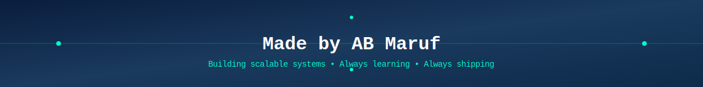

---

## 👋 Abdullah Al Maruf

<table>
<tr>
<td></td>
<td></td>
</tr>
</table>

---

## 🧑‍💻 About Me

| | |
|---|---|
| - 🎓 **B.Sc. in CSE (Network Major)** from United International University, Dhaka (2025).  - 🌐 Passionate about **Network Engineering, Cybersecurity, and System Reliability**, with interests in **Network Security & Defense**, **Cognitive Radio Networks**, and **IoT & Embedded Systems**.  - 🧪 Experienced with **embedded projects, full-stack web platforms, telemedicine systems, and API testing**, turning academic concepts into practical solutions.  - 📚 Currently **pursuing CCNA (Cisco NetAcad)** and certified in **Introduction to Cybersecurity (Cisco)**.  - 🔍 Always exploring new tools, reading technical papers, and experimenting with simulations (Omnet++, NS2/NS3, Packet Tracer) to deepen my understanding of modern networks. |  |

---

## 🌐 Find Me Here

---

## 🛡️ Core Competencies

### 🔌 Network Engineering & Protocols

### 🔐 Cybersecurity Fundamentals

### 🛠️ Tools & Technologies

---

## 🎓 Courses & Certifications

### 📡 CCNA — Cisco NetAcad

| Module | Certificate |
|--------|-------------|
|  |  |
|  |  |
|  | - |

---

### 🔐 Introduction to Cybersecurity

| Certification | Certificate |
|---------------|-------------|
|  |  |

---

## 🌍 Languages

---

## 📌 Projects

| | |
|---|---|
| **🤖 Autonomous Shortest-Path Line-Follower Robot**  Designed a robot that maps complete routes and computes optimal shortest paths autonomously. Implemented real-time navigation using ESP32, motor control, and sensor integration.      ➡️ [Repository](https://github.com/ABMaruf/line-follower-robot) | **🕌 NEKI — Islamic Community & Learning Platform**  Built a platform for Quran/Hadith reading, Arabic learning, prayer times, and event alerts. Implemented gamified achievements and designed a modern UI in Figma with Firebase cloud backend.      ➡️ [Repository](https://github.com/ABMaruf/Neki-an-islamic-App-) |
| **🏥 Digital Healthcare System — Telemedicine Platform**  Developed a telemedicine system for rural patients with separate doctor and patient dashboards. Added features for appointment scheduling, e-prescriptions, and automated SMS/video link notifications.      ➡️ [Repository](https://github.com/ABMaruf/Digital-Health-Care-System) | **🧪 API & System Testing — Software Quality Assurance**  Conducted unit and system-level REST API testing. Applied both black-box and white-box testing strategies to validate endpoints and system behavior comprehensively.     |
| **🚨 ERMS — Emergency Rescue Management System**  Real-time platform for incident reporting and emergency response coordination with live chat and volunteer coordination dashboard for rescuers and victims.      ➡️ [Repository](https://github.com/ABMaruf/Emergency-Rescue-Management-System-ERMS-) | **🤖 Ansar — Desktop AI Assistant**  Desktop AI assistant capable of voice interaction, code generation, and multi-modal responses. Integrated speech recognition and LLM APIs for intelligent task automation.      ➡️ [Repository](https://github.com/ABMaruf/ansar) |
| **📋 Team and Task Management System**  Complete project collaboration platform for team management, task tracking, and project organization. Features real-time updates and team coordination tools.      ➡️ [Repository](https://github.com/ABMaruf/Team-and-Task-Management-System) | |

---

## 📚 Research

### Trust-Aware Spectrum Management in Cluster-Based CRNs (TSM-CRN)

**Status:** Independent research, manuscript in preparation (2026)

Designing a **trust computation and certificate-based authentication framework** for cognitive radio network clusters. Simulating **cooperative spectrum sensing** to evaluate performance and security.

   

---

## ❤️ Interests

---

## 🔥 GitHub Streak

---

**Building scalable systems. Always learning. Always shipping.** 🚀

